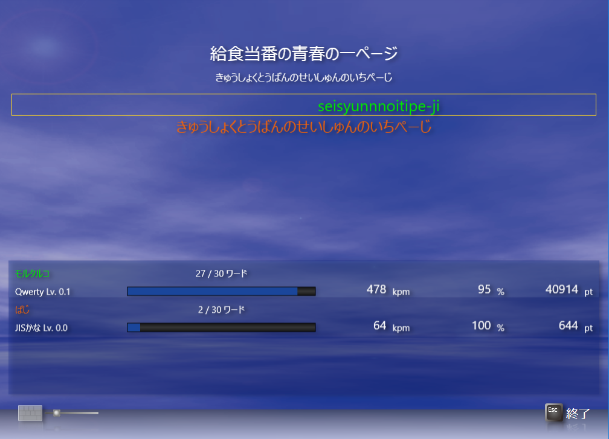
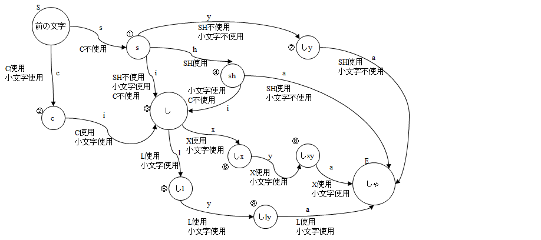

# WeatherTyping

Weather Typingは，タイピングを楽しむためのタイピングソフトである。普通にタイピングを練習する他、ネットワーク対戦やネットランキングで他のユーザと競い合ったり，自作の入力方式や自作のワードを使うといった楽しみ方ができる場を提供する。Weather Typingは以下のWebサイトからダウンロードできる。  
<https://denasu.com/>

本GitHubリポジトリは、Weather Typingのプラグインを開発するためのオープンソースプロジェクトである。Weather Typing自体はクローズドソースのフリーソフトウェアであるが、プラグイン部分はユーザが自由に開発できるようになっている。

  
Weather Typingのイメージ

## プラグインの概要

プラグインとしては、今のところ入力方式のプラグインのみをサポートしている。Weather Typing単体でも、QwertyやDvorakのような単純な配列のカスタマイズはできるのだが、例えばモールス信号や携帯入力のような特殊な入力方法を使いたい場合、配列カスタマイズではどうしても限界がある。そこで、自らDLLを作成することで、自分が得意な入力方式を使えるようになる。さらに、もしあなたがこれからタイピングソフトを作ろうとしていたり、むしろタイピングソフトの作者だった場合、本プラグインを採用することで、簡単にタイピングソフトを作ったり、プラグインをサポートすることができる、というほど簡単でもないが、検討して頂きたい。

## ビルド環境の構築

まずは公式のプラグインをビルドしてみよう。リポジトリを見ると、以下の構成になっているはずである。  
    WeatherTyping  
    └ Plugins  
    &nbsp;&nbsp;&nbsp;&nbsp;└WeatherTypingPlugin  
    &nbsp;&nbsp;&nbsp;&nbsp;└WeatherTypingPluginDenasu  
    &nbsp;&nbsp;&nbsp;&nbsp;└WeatherTypingPluginSample

WeatherTypingPluginは、プラグイン開発に必要なクラスが入ったライブラリである。WeatherTypingPluginDenasuは、Qwertyなど、Denasu System公式の入力方式が入ったプラグインDLLである。WeatherTypingPluginSampleは、最低限の実装をしたサンプルのプラグインDLLである。実際の開発では、公式プラグインを改造してカスタマイズするか、サンプルを改造して新しくプラグインDLLを作ることになる。

Weather Typingプラグインは、Visual Studio 2017（Communityエディションも可）で開発できる。.NETのDLLが作成できれば他のツールでも構わない。Visual Studioの場合は、「.NETデスクトップ開発」を選択すること。環境ができたら、WeatherTyping.slnファイルを開き、ビルドしてみよう。WeatherTypingPlugin.dll、WeatherTypingPluginDenasu.dll、WeatherTypingPluginSample.dllができれば成功である。新規にプラグインを作成する場合，.NET Standard 2.0で作成すること。ここではサンプルとして用意されているプロジェクトを使う。

## サンプルプラグインを試す

サンプルプラグインの中には以下のファイルが見つかる。以降、これらのファイルを中心に解説していこう。
* KeyFilterSampleV1.cs
* KeyCustomSampleV1.cs
* InputFilterSampleV1.cs
* InputCustomSampleV1.cs
* PluginInfo.cs

### プラグインの種類

入力プラグインは、大きく分けてKeyFilterとInputFilterに分けられる。

KeyFilterは、ハードウェア（キーボード）レベルでのカスタマイズを行う。公式のキーボードでいえばNICOLAのように、キーを押すタイミングを見るものや特殊なシフトを使う場合などに用いる。モールス信号なんかもこのカテゴリである。サンプルでは、シフトキーの動作を逆転する（シフトを押すと小文字、押さないと大文字になる）プラグインを用意してみた。

InputFilterは、ソフトウェア（IME）レベルでのカスタマイズを行う。公式のキーボードでいえばローマ字入力やかな入力のように、キーを押す順番を使う場合に用いる。1つのキーで複数の文字を打てるような入力方式もこのカテゴリである。サンプルでは、どんな文字が来ても「A」を押せば入力できるプラグインを用意してみた。

### サンプルプラグインのインストール
サンプルのビルドに成功したら、WeatherTypingPluginSample.dllを以下のフォルダにコピーする。

* インストーラからインストールした場合：C:\Users\ユーザ名\AppData\Roaming\Denasu System\Weather Typing\InputMethod
* zipからインストールした場合：WeatherTypingをインストールしたフォルダ\InputMethod

### サンプルキー配列の作成

サンプルプラグインを使うために、新しいキー配列を作成する。WTEditorを起動し、新しいキー配列を作成する。名前を「サンプルキー配列」、著作者を好きな名前にし、KeyFilterに「Sample:Sample v1」、InputFilterに「Sample:Sample v1」を設定する。見つからない場合、サンプルプラグインのインストールが正しくできているか確認すること。次に、右側のキーボードで、Qwertyでいう「A」の位置に「A」を設定する。

  

設定が終わったら名前を付けて保存して、以下のデフォルトの位置に保存する。

* インストーラからインストールした場合：C:\Users\ユーザ名\AppData\Roaming\Denasu System\Weather Typing\InputMethod\sample.keymap
* zipからインストールした場合：WeatherTypingをインストールしたフォルダ\InputMethod\sample.keymap

### サンプルキー配列を使ってみる

さて、いよいよサンプルプラグインを使ってみよう。Weather Typingを起動してシングルモードを選択すると、キー配列として「サンプルキー配列」を選択できるようになっているはずだ。これを選択してゲームスタートしてみよう。

どうだろうか。入力文章に関わらず、全ての文字が「a」になっているのが確認できるだろう。ただし、入力は大文字の「A」でないと打てないはずだ。また、キー配列を表示すると、さきほど設定した「A」だけがある配列が見えるはずである。

## サンプルプラグインの解説

ここでは、サンプルプラグインを題材として、プラグインの作り方を解説する。

### KeyFilter

KeyFilterを作るには、IKeyFilterインターフェースを実装する必要がある。また、セキュリティ上の都合からMarshalByRefObjectを継承する必要がある。

    public class KeyFilterSampleV1 : MarshalByRefObject, IKeyFilter

Version、Name、Author、Memoプロパティはだいたい想像通りの役割をする。

Languageプロパティは、入力方式のサポートする言語をja-JPなどの形式で指定する。KeyFilterはあまり言語に依存しないので、通常は空（全言語サポート）とするのがよいだろう。

    public List<string> Language
    {
        get
        {
            return new List<string>() {  };
        }
    }

GetNamesメソッドは、再割り当て可能なキーの名前を返す。サンプルでは特に設定していないが、例えば親指シフトの場合、無変換キーと変換キーを左右の親指キーに設定し、後で任意のキーに割り当てることができる。ここで返す文字列がWeather Typingのキーボードの設定に表示される。

    public List<string> GetNames()
    {
        return new List<string>()
        {
            "左親指シフトキー",
            "右親指シフトキー",
        };
    }

Convertメソッドは入力した物理キーを受け取り、何らかの変換をして返す。physicalKeyはint型になっているが、実際にはWeatherTypingPluginプロジェクトにあるWTKeyCode列挙型の組合せ（WTKeyCode.Shift | WTKeyCode.Aなど）になっている。pressed（キーが押されたか離れたか）、currentTime（キー操作の時刻）を使って自由にキーを改変できる。

    public List<int> Convert(int physicalKey, bool pressed, long currentTime, IKeyCustom keyCustom)

IKeyCustomは、KeyFilter用のカスタマイズオブジェクトで、あらかじめCreateKeyCustomから自作のオブジェクトを返しておくと、ユーザが割り当てたキーが設定されてConvertに渡ってくる。

    public interface IKeyCustom
    {
        void SetMappedKey(string name, WTKeyCode keyCode);
        WTKeyCode GetMappedKey(string name);
    }

例えば、親指シフトであればGetMappedKey("左親指シフトキー")を実行すると、ユーザが左親指キーに割り当てたキーコードが帰ってくる。

### InputFilter

InputFilterを作るには、IInputFilterインターフェースを実装する必要がある。また、セキュリティ上の都合からMarshalByRefObjectを継承する必要がある。

    public class InputFilterSampleV1 : MarshalByRefObject, IInputFilter

KeyFilter同様、Version、Name、Author、Memoプロパティはだいたい想像通りの役割をする。

KeyMapsには、WTEditorのキー配列で作成した内容が入ってくる。キーに割り当てた仮想キー(Unicodeの文字コード)と物理キー（WTKeyCode）の組合せが、キー平面ごとに入っている。キー平面は、InputFilterの作成者が勝手に割り当てることができるキーのセットで、WTEditorのキー配列で設定する「キーボード」と「モード」の組合せによって自由に平面の番号を割り当て、GetPlaneで番号を返す。

    public List<List<KeyMap>> KeyMaps { set; get; }

    public struct KeyMap
    {
        public int VirtualKey { get; set; }
        public int PhysicalKey { get; set; }
    }

例えば、Qwertyであればキーボードとして101、106キーボード、モードとしてデフォルトモードをサポートする。

    private static List<InputKeyboard> supportedKeyboard = new List<InputKeyboard>()
    {
        new InputKeyboard()
        {
            Author = "Denasu System",
            Name = "101 Keyboard",
            Version = 1
        },
        new InputKeyboard()
        {
            Author = "Denasu System",
            Name = "106 キーボード",
            Version = 1
        },
    };

    private static List<string> supportedMode = new List<string>()
    {
        "Default",
    };

KeyMapsは以下のようになる。

キー平面1（デフォルトモード/101キーボードの組合せ）

    keyMap.VirtualKey = '@',  
    keyMap.PhysicalKey = WTKeyCode.Shift | WTKeyCode.Num2

キー平面2（デフォルトモードの106キーボードの組合せ）

    keyMap.VirtualKey = '\"',  
    keyMap.PhysicalKey = WTKeyCode.Shift | WTKeyCode.Num2

他の例として、JISかなの場合、キーボードは106のみ、モードはアルファベットとかなの2つをサポートする。かなモードの場合、VirtualKey='あ'、PhysicalKey=Num3などの値が入っている。

ここまででInputFilterの設定を一通り見てきたので、実際の入力を見てみよう。まずは問題文章からオートマトンを作成するToAutomatonから解説する。

    public virtual InputAutomaton ToAutomaton(string s, InputKeyboard keyboard)

ToAutomatonは問題文章が決まったときに呼び出される関数で、文字列sには実際に入力する文字列、つまりWTEditorのワードで入れた「読み方」が入ってくる。具体的にはひらがなである。keyboardはもちろんユーザが選択したキーボードだ。これらの情報からAutomatonを作るのがToAutomatonのタスクである。オートマトンについては専門の書籍に任せるとして、ここではWeather Typingでのオートマトンの使い方を説明しよう。

  

上の図はこんな時のためにずいぶん前に作っておいた図だが、「しゃ」という問題文があったときにInputFilterRomanV1が作るオートマトンである。InputFilterRomanV1はInitKeyMapで以下のテーブルを作り、ToAutomatonで上の図のオートマトンを作成する。

    AddStroke(false, "シ", new int[] { 's', 'i' }, "si", InputCustomRomanV1.Ope_NO_SH.Or(InputCustomRomanV1.Ope_NO_C));
    AddStroke(false, "シ", new int[] { 's', 'h', 'i' }, "shi", InputCustomRomanV1.Ope_SH.Or(InputCustomRomanV1.Ope_NO_C));
    AddStroke(false, "シ", new int[] { 'c', 'i' }, "ci", InputCustomRomanV1.Ope_C);
    AddStroke(false, "ャ", new int[] { 'x', 'y', 'a' }, "xya", InputCustomRomanV1.Ope_X);
    AddStroke(false, "ャ", new int[] { 'l', 'y', 'a' }, "lya", InputCustomRomanV1.Ope_L);
    AddStroke(false, "シャ", new int[] { 's', 'y', 'a' }, "sya", InputCustomRomanV1.Ope_NO_SH);
    AddStroke(false, "シャ", new int[] { 's', 'h', 'a' }, "sha", InputCustomRomanV1.Ope_SH);

なお、サンプルでは文字1文字につき「a」を固定入力するオートマトンを1つ作成し、シンプルにつなげていく実装になっている。

    for (int i = 0; i < s.Length; i++)
    {
        var newAutomaton = new InputAutomaton();
        current.SetConnect((int)WTKeyCode.A, new InputAutomaton.Connect()
        {
            Automaton = newAutomaton,
            Character = "a",
            Flags = Ope_NO_XN,
        });
        current = newAutomaton;
    }

次はオートマトンから入力文字列を作成するFromAutomatonを解説する。

    public virtual string FromAutomaton(InputAutomaton root, InputAutomaton current, IInputCustom custom, ref int pos, ref int nextCharacter)

FromAutomatonは、rootで示されたオートマトンを、customに指定された入力カスタマイズに従って入力文字列を生成する。ローマ字入力の場合なら入力文字列はアルファベット列、かな入力ならかなになる。posとnextCharacterにはそれぞれオートマトンをcurrentまでたどったときの位置と、次に打つべき文字を返す。サンプルでは、オートマトンを順番にたどるシンプルな実装になっている。

    while (!(automaton.IsAccept()))
    {
        var select = automaton.GetConnect().First();

        int c2 = select.Key;
        string addstring = select.Value.Character;

        if (nextCharacter != -1)
        {
            nextCharacter = c2;
            break;
        }

        bool valid2 = false;
        result.Append(addstring);
        automaton = automaton.Input(c2, ref valid2, null);
        if (current == automaton)
        {
            pos = result.Length;
        }
    }

IInputCustomは、文字入力のユーザカスタマイズである。この辺りはWeather Typing本体の処理が分かっていた方が理解が進むと思うので少し説明する。例えば上の図の「しゃ」の場合だと、「CよりはSを使う」「SHよりはSYを使う」「LYAやXYAは使わない」設定であればS→1→7→Eを通って「SHA」を画面に表示する。その後のユーザ入力時，設定と画面表示を更新しながらオートマトンを処理していく。例えば「CILYA」と入力したときは2へ行って「SよりはCを使う」設定に変更。3→5へ行って「LYAやXYAを使う」設定に変更。最後に9→Eへ行って完了。上の矢印以外の入力が来たらミス扱い。といった流れになる。プラグイン側は、これらの設定をそれぞれCustomizationのBitFlagに自由に割り当てる。このあたりはかなり複雑なのでかなとローマ字の実装をじっくり解析してみるのをお勧めする。

    public interface IInputCustom
    {
        BitFlag Customization { get; set; }

        bool IsSet(BitFlag flags);
        void SetFlags(BitFlag flags);
    }

残るのはWTEditorのキー配列やWeather Typing本体でキー配列表示したときに、キー配列を設定または表示するためのメソッド2つだ。まずはGetKeyLabelを見ていこう。

    public virtual List<string> GetKeyLabel(int plane, int physicalKey)

このメソッドは、あるキー平面のある物理キーに対応する仮想キーを返す。要するに、キーコードに対応する文字を返すわけで、ローマ字の例でいうと「106キーボードでWTKeyCode.Aに対応する文字はAだ」というのを返すということだ。サンプル実装ではまさにAの場合のみ処理している。

    var mapKey = KeyMaps[plane].Where(x => x.PhysicalKey == physicalKey);
    foreach (var key in mapKey)
    {
        // Convert to virtual code
        var virtualKey = key.VirtualKey;

        // Get string
        if (virtualKey != (int)WTKeyCode.A)
        {
            continue;
        }

        // Always return A!
        result.Add("A");
    }

最後はGetKeyCodeである。

    public virtual int GetKeyCode(int plane, string label)

このメソッドは、GetKeyLabelの逆で、文字に対応するキーコードを返す。サンプルではやはりAの場合のみ処理している。

    if (label != "A")
    {
        return -1;
    }

    return (int)WTKeyCode.A;

### PluginInfo

最後に，プラグインDLL一つごとにIPluginInfoを実装したクラスを用意する必要がある。これは現状公式のプラグインしかみていないが，将来的に他のプラグインでもランキングに参加できるようになったときに使われる予定である。実装方法は中身を見ればすぐに分かるのでここでは省略する。

## 注意事項

* プラグインはサンドボックス上で動作し、ファイルI/Oやデバイスの利用などは一切できない。これはプラグインをWebで配布し、他のユーザに使ってもらうことを想定しているためである。しかし、音声入力の練習ソフトなどには必要になるので、今後緩和する可能性もある。
* WeatherTypingPlugin.dllプロジェクトはソースの参照用である。プラグインのビルド時はGitHubのプロジェクトではなくWeatherTyping本体付属のDLLを参照することを推奨する。

## 終わりに

Weather Typingのプラグインの作り方について一通り解説した。とはいっても一から実装するのはかなり難しいので、まずは公式のローマ字とかな配列を改造しながら作ってみるのをお勧めする。将来的にはGitHub連動でDenasu Systemサイトからプラグインをダウンロードしたりというのも考えているので、面白いプラグインを思いついたら是非公開していって欲しい。

2017 Denasu System モルタルコ

